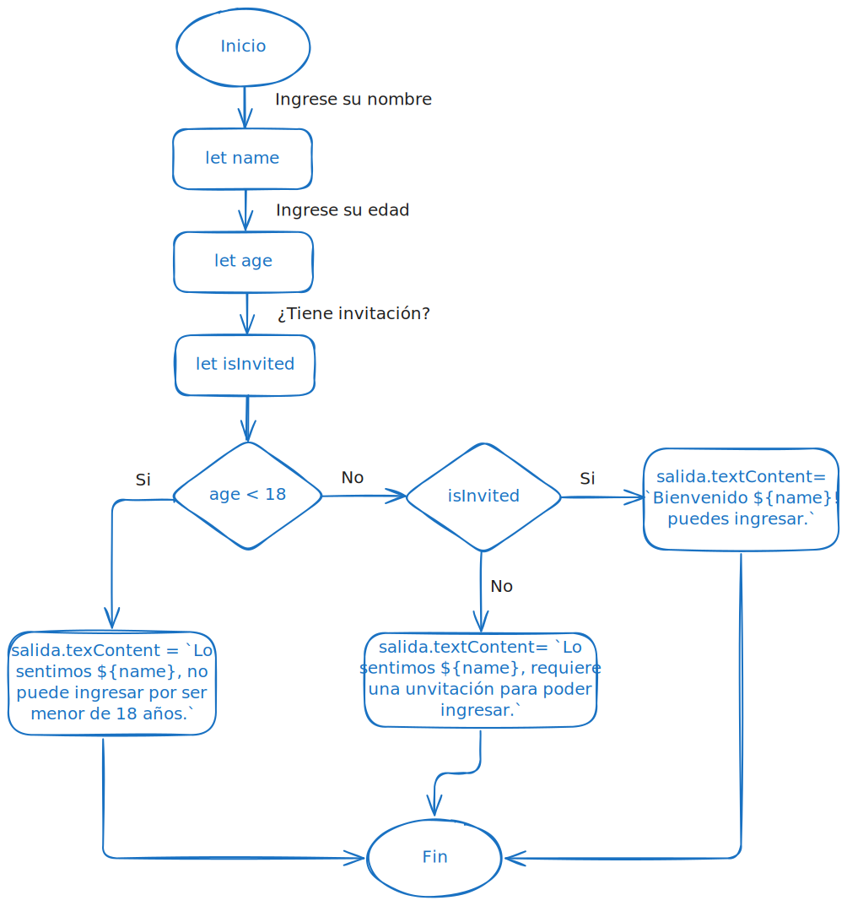

<h1>Control de Acceso</h1>

Este reto contiene una pantalla para el control de acceso a un evento, el usuario deberá almacenar información como nombre, edad y si tiene invitación para poder tener acceso y obtener un mensaje de bienvenida.

<h2>Diagrama de flujo reto 1</h2>

<h2>Instrucciones de uso</h2>

Para poder usar la página debe seguir las siguientes instrucciones:

<ol>
<li>Ingresar en la página.</li>
<li>Escribir su nombre en el cuadro de texto donde dice "Escriba su nombre".</li>
<li>Escribir su edad (solo números) en el cuadro de texto donde dice "Escriba su edad".</li>
<li>Marcar en la casilla que corresponda respondiendo a la pregunta ¿Tiene invitación?.</li>
<li>Seleccionar el botón enviar</li>
</ol>

Si presenta algún problema, verifique los datos ingresados.
