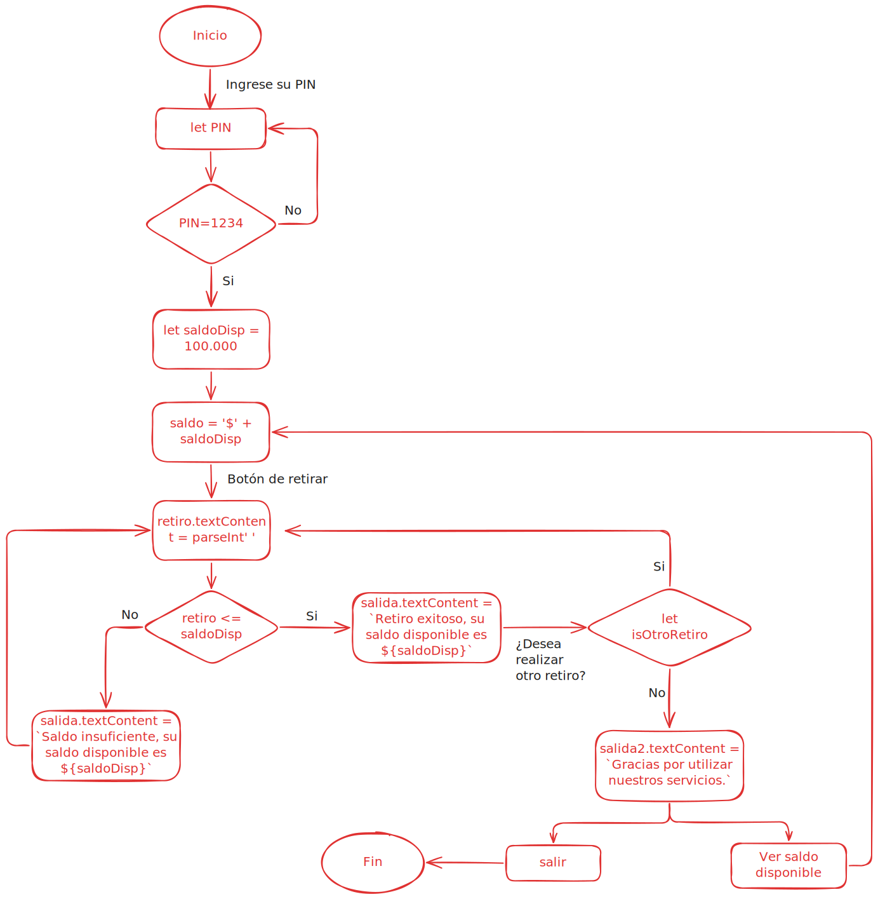

<h1>Cajero automático BancoYA</h1>

Este reto contiene un sitio web para ingresar a un cajero automático virtual, donde se presenta una pantalla de ingreso que debe validad los datos de acceso al banco, posterior al ingreso, el usuario pordrá realizar retiros de dinero, ver el saldo disponible y salir del cajero.

<h2>Diagrama de flujo reto 2</h2>

<h2>Instrucciones de uso</h2>

Para poder usar el sitio web debe seguir las siguientes instrucciones:

<ol>
<li>El usuario predeterminado no se debe cambiar.</li>
<li>Escribir el PIN de acceso en el cuadro de texto que dice "Escriba 1234", el PIN es 1234.</li>
<li>Dar click en el botón ingresar y esperar el ingreso.</li>
<li>Si desea realizar un retiro, de click en el botón "Retirar".</li>
<li>Ingrese el valor que desea retirar, recuerde que debe ser un valor mayor a 10.000 y menor del saldo disponible.</li>
<li>Dar click en el botón "Hacer retiro".</li>
<li>Puede hacer otro retiro colocando nuevamente un valor en la caja de texto o ver el saldo disponible en eñ botón "Ver saldo disponible"</li>
<li>Si se encuentra en la pantalla de retiro y desea volver al saldo disponible sin realizar un retiro, de click en el botón "Volver".</li>
<li>Si desea salir, de click en el botón salir que aparece en la pantalla de saldo disponible y al realizar un retiro.</li>
</ol>

Si presenta algún problema, verifique los datos ingresados.
