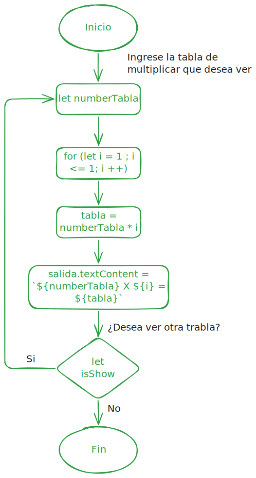

<h1>Tablas de Multiplicar</h1>

Este reto contiene una pantalla para ingresar el número de la tabla de multiplicar que desea ver, la tabla mostrará los resultados de multiplicación del 1 al 10 de un número ingresado por el usuario.

<h2>Diagrama de flujo reto 2</h2>

<h2>Instrucciones de uso</h2>

Para poder usar el sitio web debe seguir las siguientes instrucciones:

<ol>
<li>Ingrese a la página.</li>
<li>Escriba el número de la tabla de multiplicar que desea ver en la caja de texto "Escriba un número".</li>
<li>Dar click en el botón "Ver tabla".</li>
<li>Si desea ver otra tabla de multiplicar de click en el botón "Ver otra tabla de multiplicar" y repira los pasos anteriores.</li>
<li>Si desea salir del programa de click en el botón "Salir".</li>
</ol>

Si presenta algún problema, verifique los datos ingresados.
